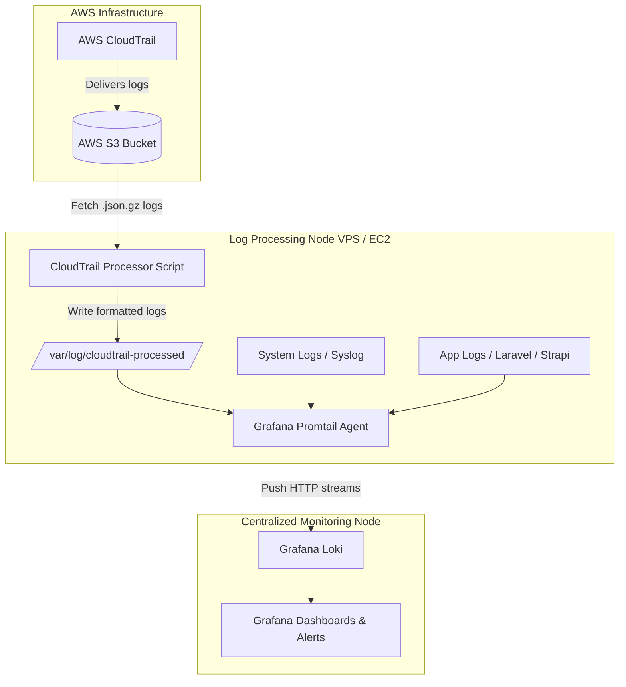

# AWS CloudTrail & Application Log Monitoring Pipeline

An automated log collection, processing, and visualization architecture using **AWS CloudTrail**, **Python Processor**, **Grafana Promtail**, **Grafana Loki**, and **Grafana Dashboards**.

This solution ingests AWS CloudTrail logs from Amazon S3, parses and enriches security and operational events, collects server system and application logs (including Laravel and Strapi), and ships all telemetry to Grafana Loki for centralized visualization and alerting.

---

## 📌 Architecture Overview



---

## 🚀 Key Features

- **CloudTrail Log Processing**: Automatically polls S3 for new CloudTrail logs, decompresses JSON payloads, extracts identity details (`iam_username`, `arn`, `access_key_id`), action details, source IPs, and status.
- **State Management & Deduplication**: Tracks processed log files in state JSON to prevent duplicate processing.
- **Unified Application Monitoring**: Configurable Promtail setups tailored for system logs, Laravel logs, and Strapi application logs.
- **Pre-built Grafana Dashboards**: Includes complete JSON dashboards for CloudTrail security auditing, application health metrics, and aggregated instance errors.
- **Alerting Framework**: Integration scripts for configuring automated Grafana alerts and SMTP notifications.

---

## 🛠️ Repository Structure

| File / Directory | Description |
|------------------|-------------|
| `cloudtrail_processor.py` | Core Python service for fetching, parsing, and formatting CloudTrail logs from S3. |
| `cloudtrail_processor_enhanced.py` | Enhanced variant supporting additional log fields and state handling. |
| `config.yaml` | Configuration file for AWS credentials, S3 bucket names, regions, and output directories. |
| `promtail-config.yaml` | Promtail agent configuration for reading processed CloudTrail logs. |
| `promtail-ec2-config.yaml` | Promtail agent configuration for standard EC2 system metrics and logs. |
| `promtail-laravel-config.yaml` | Promtail log scraping configuration tailored for Laravel framework logs. |
| `promtail-strapi-config.yaml` | Promtail log scraping configuration tailored for Strapi CMS logs. |
| `setup.sh` | Automated setup script for initializing dependencies, Promtail, and systemd services. |
| `grafana-cloudtrail-dashboard.json` | Grafana dashboard dedicated to CloudTrail event telemetry. |
| `grafana-main-dashboard.json` | Grafana overview dashboard for instance health and error aggregation. |
| `DEPLOYMENT.md` | Detailed step-by-step guide for manual setup and troubleshooting. |
| `ALERTING-SETUP.md` | Configuration guide for email and webhook alerting in Grafana. |

---

## 📋 Prerequisites

Before deploying to a Virtual Private Server (VPS) or AWS EC2 instance, ensure the following requirements are met:

1. **Operating System**: Ubuntu 20.04/22.04 LTS or Amazon Linux 2/2023.
2. **Software**: Python 3.8+, `pip`, `python3-venv`, `curl`, `unzip`, and `aws-cli`.
3. **AWS IAM Access**: An IAM Role attached to the instance or AWS credentials with read permissions (`s3:GetObject`, `s3:ListBucket`) to the CloudTrail S3 bucket.
4. **Grafana Loki Instance**: A running Grafana Loki instance reachable via HTTP over port 3100.

---

## ⚙️ VPS / EC2 Setup Instructions

### Method 1: Quick Automated Installation

1. Clone or upload the repository to your VPS:
   ```bash
   git clone <repository-url> cloudtrail-promtail-grafana
   cd cloudtrail-promtail-grafana
   ```

2. Make the setup script executable and run it:
   ```bash
   chmod +x setup.sh
   ./setup.sh
   ```
   *Note: Do not run as root. Run as a standard user with sudo privileges (e.g., `ubuntu` or `ec2-user`).*

3. Follow the interactive prompts to specify your AWS region, CloudTrail S3 bucket name, and Loki server IP address.

---

### Method 2: Manual Installation & Configuration

If you prefer to configure components manually or deploy into an existing infrastructure, follow these steps:

#### Step 1: Create System Directories
```bash
sudo mkdir -p /opt/cloudtrail-processor
sudo mkdir -p /var/log/cloudtrail-processed
sudo mkdir -p /etc/promtail
sudo mkdir -p /var/lib/promtail

# Assign ownership to your user (e.g., ubuntu)
sudo chown -R ubuntu:ubuntu /opt/cloudtrail-processor /var/log/cloudtrail-processed /var/lib/promtail /etc/promtail
```

#### Step 2: Deploy Python Processor Files
```bash
cp cloudtrail_processor.py /opt/cloudtrail-processor/
cp config.yaml /opt/cloudtrail-processor/
cp requirements.txt /opt/cloudtrail-processor/
```

#### Step 3: Configure Application Settings
Edit `/opt/cloudtrail-processor/config.yaml` to match your AWS environment:
```yaml
aws:
  region: us-east-1              # Replace with your AWS region
  s3_bucket: my-cloudtrail-bucket # Replace with your S3 bucket name
  s3_prefix: AWSLogs/            # CloudTrail log prefix in S3

output_dir: /var/log/cloudtrail-processed
state_file: /var/lib/promtail/cloudtrail-state.json
retention_days: 7
```

#### Step 4: Setup Python Virtual Environment
```bash
cd /opt/cloudtrail-processor
python3 -m venv venv
./venv/bin/pip install --upgrade pip
./venv/bin/pip install -r requirements.txt
```

#### Step 5: Install Promtail
```bash
cd /tmp
curl -O -L "https://github.com/grafana/loki/releases/download/v2.9.3/promtail-linux-amd64.zip"
unzip -q promtail-linux-amd64.zip
sudo mv promtail-linux-amd64 /usr/local/bin/promtail
sudo chmod +x /usr/local/bin/promtail
```

#### Step 6: Configure Promtail
Copy the relevant Promtail configuration to `/etc/promtail/promtail-config.yaml`:
```bash
cp promtail-config.yaml /etc/promtail/promtail-config.yaml
```
Update the Loki endpoint in `/etc/promtail/promtail-config.yaml`:
```yaml
clients:
  - url: http://<LOKI_SERVER_IP>:3100/loki/api/v1/push
```

#### Step 7: Enable and Start Systemd Services
```bash
sudo cp cloudtrail-processor.service /etc/systemd/system/
sudo cp promtail.service /etc/systemd/system/

sudo systemctl daemon-reload
sudo systemctl enable --now cloudtrail-processor
sudo systemctl enable --now promtail
```

---

## 📊 Grafana Dashboard Setup

1. Log into your Grafana web UI (e.g., `http://<GRAFANA_IP>:3000`).
2. Ensure **Grafana Loki** is configured as a Data Source.
3. Navigate to **Dashboards** → **Import**.
4. Upload `grafana-cloudtrail-dashboard.json` or `grafana-main-dashboard.json` from this repository.
5. Select your Loki datasource and click **Import**.

---

## 🔍 Verification & Troubleshooting

- **Check Service Status**:
  ```bash
  sudo systemctl status cloudtrail-processor
  sudo systemctl status promtail
  ```
- **View Live Logs**:
  ```bash
  sudo journalctl -u cloudtrail-processor -f
  sudo journalctl -u promtail -f
  ```
- **Inspect Processed Files**:
  ```bash
  ls -lh /var/log/cloudtrail-processed/
  ```
- **Backfill Historical Data**:
  To ingest up to 90 days of past logs from S3, execute:
  ```bash
  ./backfill-cloudtrail.sh
  ```

---

## 📄 License

This project is maintained for infrastructure log management and cloud security observability. Refer to internal team guidelines for deployment policies.
